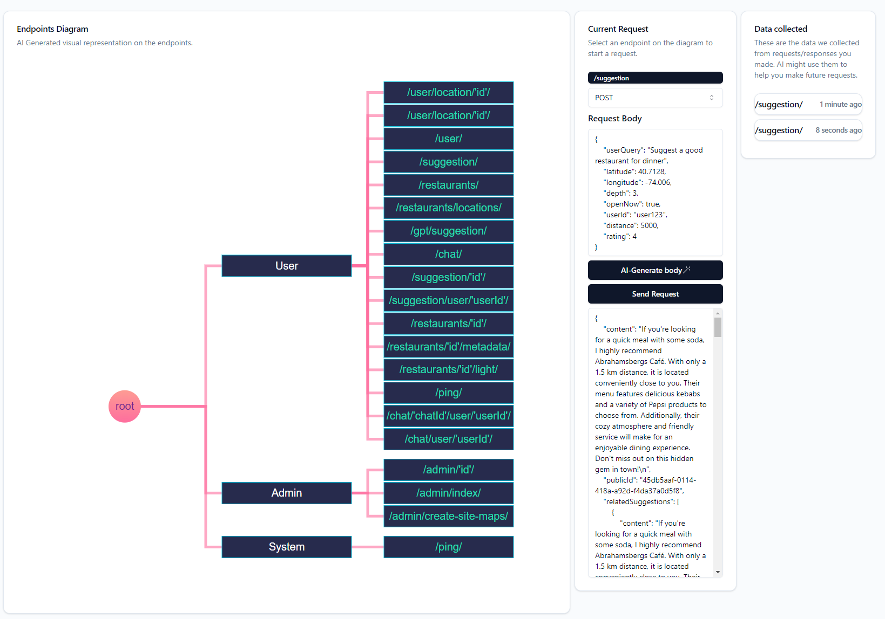

# Fences

An LLM augmented OpenAPI specification interpreter that provides a human-readable interactive representation of APIs, automatically generate requests and stores both requests and responses on your browser to improve AI-generated requests in future queries.

Fences operates similarly to SwaggerUI, but with a more human-friendly interface. It uses AI to create a visual diagram and categorize endpoints. After the initial parse Fences uses the OpenAPI specification to automatically generate request bodys for you, filling with it with sample data. It stores every single request and response data in your browser to better generate future requests. Data is only stored locally, the only third-party server it uses is Anthropic's API to access LLMs.



# Work in progress
Fences is still under construction and may break for some edge cases.
Please submit an issue with a reproducible example if you encounter any problems.

# Usage
```sh
pip install fences # Installation command
fences LINK_TO_THE_OPENAPI_SPEC
```

You will be prompted to enter your anthropic key so that fences can make requests to an LLM model to parse the OpenAPI specification.

# How to contribute
PR's are welcome!

Please create an issue before opening a PR so that we can discuss the changes you want to make.

# How to setup your dev enviroment

```sh
pip install -r requirements.txt
cd ui && npm install && npm run build && cd..
python fences/fences.py
```
